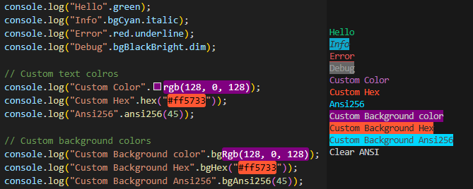

# Coloriz

**[Coloriz](https://github.com/Oignontom8283/coloriz)** is a lightweight extension of [Chalk](https://www.npmjs.com/package/chalk) that enhances the `String` prototype to make styling terminal output more intuitive and expressive.

Instead of calling functions like `chalk.red("text")`, you can now simply write `"text".red` or `"text".bld.bgYellowBright`.

> ❗ **Note:** Coloriz is *not* a replacement for Chalk — it uses Chalk under the hood. It's a syntactic enhancement, not a standalone coloring engine.



## ✨ Features

- Extends `String.prototype` with style and color properties
- Fully powered by [Chalk](https://www.npmjs.com/package/chalk)
- Supports:
  - Legacy ANSI colors (16/32 colors)
  - Bright and background variants
  - Text styles (bold, italic, underline, etc.)
  - Additional utility functions: `.rgb()`, `.hex()`, `.ansi256()`
  - `.clearANSI` property.
- Zero configuration — import once and use everywhere
- Works in both JavaScript and TypeScript


## 🚀 Installation

```bash
npm install coloriz
```

> ⚠️ Requires Node.js v16+


## 📦 Usage

### JavaScript

```js
require("coloriz");

console.log("Hello".green);
console.log("Info".bgCyan.italic);
console.log("Error".red.underline);
console.log("Debug".bgBlackBright.dim);

// Custom text colros
console.log("Custom Color".rgb(128, 0, 128));
console.log("Custom Hex".hex("#ff5733"));
console.log("Ansi256".ansi256(45));

// Custom background colors
console.log("Custom Background color".bgRgb(128, 0, 128));
console.log("Custom Background Hex".bgHex("#ff5733"));
console.log("Custom Background Ansi256".bgAnsi256(45));

// Clear ANSI codes (ex: for writing in file)
console.log("Clear ANSI".clearANSI);
```

### TypeScript ❤️

```ts
import "coloriz";

console.log("Hello".green);
console.log("Info".bgCyan.italic);
console.log("Error".red.underline);
console.log("Debug".bgBlackBright.dim);

// Custom text colros
console.log("Custom Color".rgb(128, 0, 128));
console.log("Custom Hex".hex("#ff5733"));
console.log("Ansi256".ansi256(45));

// Custom background colors
console.log("Custom Background color".bgRgb(128, 0, 128));
console.log("Custom Background Hex".bgHex("#ff5733"));
console.log("Custom Background Ansi256".bgAnsi256(45));

// Clear ANSI codes (ex: for writing in file)
console.log("Clear ANSI".clearANSI);
```


## 🎨 Available Properties

### 🎯 Text Styles

| Property        | Description                    |
| --------------- | ------------------------------ |
| `reset`         | Reset all styles               |
| `bld`           | Bold                           |
| `dim`           | Dim                            |
| `italic`        | Italic                         |
| `underline`     | Underlined                     |
| `inverse`       | Inverted foreground/background |
| `hidden`        | Hidden                         |
| `strikethrough` | Strike-through                 |


### 🎨 Text Colors

| Color 16/32 | Bright Variant   |
| ----------- | ---------------- |
| `black`     |                  |
| `red`       | `redBright`      |
| `green`     | `greenBright`    |
| `yellow`    | `yellowBright`   |
| `blue`      | `blueBright`     |
| `magenta`   | `magentaBright`  |
| `cyan`      | `cyanBright`     |
| `white`     | `whiteBright`    |
| `gray`      | *(bright black)* |


### 🎨 Background Colors

| Color 16/32 | Bright Variant    |
| ----------- | ----------------- |
| `bgBlack`   | `bgBlackBright`   |
| `bgRed`     | `bgRedBright`     |
| `bgGreen`   | `bgGreenBright`   |
| `bgYellow`  | `bgYellowBright`  |
| `bgBlue`    | `bgBlueBright`    |
| `bgMagenta` | `bgMagentaBright` |
| `bgCyan`    | `bgCyanBright`    |
| `bgWhite`   | `bgWhiteBright`   |


### 🎨 Custom Color Functions

You can also use functions to apply custom colors:

#### Text colors
| Function        | Example usage                               |
|----------------|----------------------------------------------|
| `.rgb(r, g, b)`  | `"hello".rgb(255, 0, 128)`                 |
| `.hex("#RRGGBB")`| `"hi".hex("#ffcc00")`                      |
| `.ansi256(n)`    | `"good bye".ansi256(45)`                   |

#### Background colors
| Function        | Example usage                               |
|----------------|----------------------------------------------|
| `.bgRgb(r, g, b)`  | `"hello".bgRgb(255, 0, 128)`             |
| `.bgHex("#RRGGBB")`| `"hi".bgHex("#ffcc00")`                  |
| `.bgAnsi256(n)`    | `"good bye".bgAnsi256(45)`               |


### 🧹 Utility

| Name     | Description                                    |
|----------|------------------------------------------------|
| `.clearANSI` | String property to strip ANSI codes            |


## 🧠 Notes

- You must import `"coloriz"` once in your entry point (e.g., `main.ts`, `index.js`)
- Designed for CLI tools, custom loggers, and developer UX
- Extensions are non-enumerable and do not pollute object iteration


## 🛠 Why Not Just Use Chalk?

You still are!  
Coloriz is *built entirely on top of Chalk*. It doesn't replace it — it simplifies how you use it.

| Chalk                      | Coloriz                 |
|----------------------------|-------------------------|
| `chalk.red("Hi")`          | `"Hi".red`              |
| `chalk.bold.green("Ok")`   | `"Ok".green.bld`        |
| `chalk.hex("#f00")("Hi")`  | `"Hi".hex("#f00")`      |


## ⚡ Github

--> [GitHub repository](https://github.com/Oignontom8283/coloriz)

## 📌 ChangeLog
--> [Changelog](./CHANGELOG.txt)

## 📄 License

MIT © Oignontom8283
